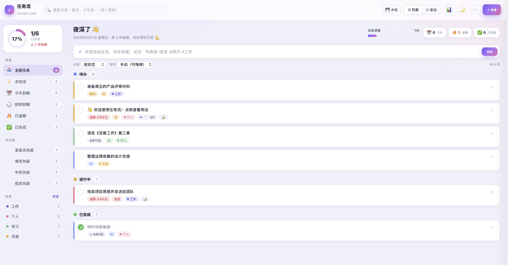
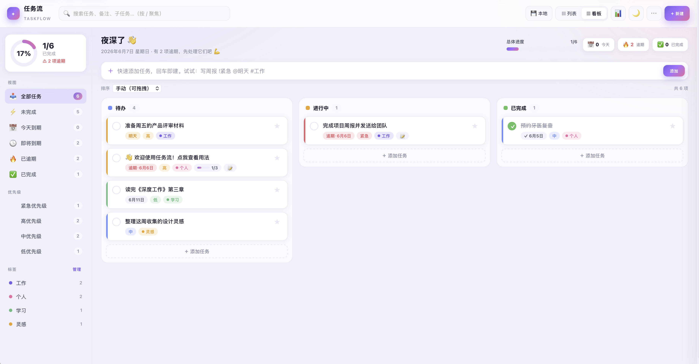

<div align="center">

# ✦ 任务流 · TaskFlow

**一个纯前端、单文件、注重隐私的任务管理器**
*A privacy-first, single-file, zero-dependency task manager that runs entirely in your browser.*

[](LICENSE)


[中文](#中文) · [English](#english)

</div>




---

## 中文

任务流（TaskFlow）是一个**单个 HTML 文件**就能跑起来的任务管理器。没有构建步骤、没有后端、没有第三方依赖，也不联网——双击文件用浏览器打开即可使用，所有数据都只留在你自己的设备上。

### ✨ 功能特性

- **两种视图**：列表视图与看板（Kanban）视图，一键切换。
- **快速添加语法**：在顶部输入框直接打字建任务，支持 `!优先级`、`@日期`、`#标签`（详见下文）。
- **任务字段齐全**：状态（待办 / 进行中 / 已完成）、优先级（低 / 中 / 高 / 紧急）、截止日期与时间、备注、子任务（带进度条）、置顶。
- **重复任务**：支持每天 / 每周 / 每月重复，完成后自动生成下一次（月末日期会智能钳位，例如 1 月 31 日的月度任务顺延为 2 月 28/29 日）。
- **标签系统**：自定义彩色标签，可重命名、改色、删除。
- **分组与排序**：按状态 / 优先级分组；按手动拖拽 / 截止日期 / 优先级 / 创建时间排序。
- **拖拽操作**：拖动卡片可排序，拖到不同列即可改变状态或优先级。
- **筛选与搜索**：按视图（今天到期 / 即将到期 / 已逾期等）、优先级、标签筛选；全文搜索标题、备注与子任务。
- **统计概览**：完成率环形图、各状态数量、今日 / 逾期 / 7 天内到期、优先级分布。
- **深色模式**：明暗主题一键切换，首屏无闪烁。
- **到期提醒**：可选的浏览器通知，提醒今天到期与已逾期的任务。
- **数据导入导出**：导出 JSON 备份、导出 Markdown 清单、从备份恢复。
- **本地优先存储**：数据默认保存在浏览器中（重启不丢）；在支持的浏览器上还可**连接一个本地 `.json` 文件**，改动自动写入——把文件放进同步盘（iCloud / 坚果云 / Dropbox 等）即可多设备共享。
- **完成动画**：任务打勾时撒花 🎉。
- **响应式**：桌面与移动端皆可使用。

### 🚀 快速开始

无需安装，无需联网：

1. 下载本仓库中的 `TaskFlow.html`（或克隆整个仓库）。
2. 双击该文件，用任意现代浏览器打开。
3. 开始添加你的第一个任务。

```bash
git clone https://github.com/DaozeTang/taskflow.git
cd taskflow
# 直接用浏览器打开 TaskFlow.html 即可
```

> 💡 **想在线托管？** 把 `TaskFlow.html` 重命名为 `index.html` 推到 GitHub，并开启 GitHub Pages，即可获得一个免费的在线版本。

### ⌨️ 快速添加语法

在顶部"快速添加"输入框里，一行字就能带上属性，回车即建：

| 语法 | 作用 | 示例 |
| --- | --- | --- |
| `!紧急` `!高` `!中` `!低` | 设置优先级（也支持 `!urgent` / `!high` …） | `修复线上 bug !紧急` |
| `@今天` `@明天` `@后天` | 设置相对截止日期 | `交周报 @明天` |
| `@2026-06-10` `@6-10` | 设置具体截止日期 | `体检 @2026-06-10` |
| `#标签名` | 添加标签（不存在则自动新建） | `读书笔记 #学习` |

组合示例：

```
写季度总结 !紧急 @明天 #工作
```

### ⌨️ 键盘快捷键

| 按键 | 功能 |
| --- | --- |
| `N` | 聚焦快速添加输入框 |
| `/` | 聚焦搜索框 |
| `T` | 切换明暗主题 |
| `L` | 列表视图 |
| `B` | 看板视图 |
| `?` | 打开"快捷键与用法" |
| `Esc` | 关闭抽屉 / 弹窗 / 侧栏 |

### 🔒 数据与隐私

- **完全本地**：没有服务器、没有账号、没有埋点、不发起任何网络请求。你的任务只存在于你的浏览器和你选择的文件里。
- **两种保存方式**：
  - **浏览器本地存储**（默认）：数据存在 `localStorage`，关掉重开也在。
  - **连接本地文件**（Chromium 内核浏览器）：通过 File System Access API 连接一个 `.json` 文件，改动自动写入，便于备份和多设备同步。
- **定期备份提醒**：超过 7 天未备份时会温和提示导出一份。

### 🌐 浏览器支持

| 功能 | Chrome / Edge | Safari / Firefox |
| --- | --- | --- |
| 核心功能（任务、视图、本地存储） | ✅ | ✅ |
| 连接本地文件自动写入 | ✅ | ➖ 自动降级为本地存储 + 手动备份 |
| 到期通知 | ✅ | ✅（需授予通知权限） |

建议使用最新版桌面浏览器。File System Access API 目前仅在 Chromium 内核浏览器可用；在其他浏览器上会自动降级，功能不受影响，只是不能"自动写文件"。

### 🛠️ 技术栈

- 单个 HTML 文件，约 1000 行，原生 HTML + CSS + JavaScript。
- **零依赖、零构建步骤、零网络请求。**
- 主题通过 CSS 变量实现；图标使用 Emoji；完成动画为手写的 Canvas 撒花。

### 🤝 参与贡献

欢迎提 Issue 与 PR。由于整个项目就是一个 HTML 文件，参与非常简单：

1. Fork 并克隆仓库。
2. 用编辑器打开 `任务管理工具.html`，修改后用浏览器刷新即可看到效果。
3. 提交 PR 时请简要说明改动动机与测试情况。

### 📄 许可协议

本项目基于 [MIT 协议](LICENSE) 开源，可自由使用、修改与分发。

---

## English

TaskFlow is a task manager that runs from **a single HTML file**. No build step, no backend, no third-party dependencies, and no network access — just open the file in your browser. All your data stays on your own device.

### ✨ Features

- **Two views**: List and Kanban board, switchable with one click.
- **Quick-add syntax**: Create tasks by typing in the top input — supports `!priority`, `@date`, and `#tag` (see below).
- **Rich task fields**: status (To Do / Doing / Done), priority (Low / Medium / High / Urgent), due date & time, notes, subtasks with a progress bar, and pinning.
- **Recurring tasks**: daily / weekly / monthly. Completing one auto-creates the next occurrence, with smart month-end clamping (a monthly task on Jan 31 rolls over to Feb 28/29 rather than skipping a month).
- **Tags**: custom colored tags you can rename, recolor, and delete.
- **Grouping & sorting**: group by status or priority; sort by manual drag, due date, priority, or creation time.
- **Drag & drop**: reorder cards, or drop them into another column to change status or priority.
- **Filter & search**: filter by view (Today / Upcoming / Overdue, etc.), priority, and tag; full-text search across titles, notes, and subtasks.
- **Stats overview**: completion-rate donut, counts per status, today / overdue / due-within-7-days, and priority distribution.
- **Dark mode**: light/dark themes with no flash on load.
- **Due reminders**: optional browser notifications for tasks due today or overdue.
- **Import / export**: export a JSON backup, export a Markdown checklist, and restore from a backup.
- **Local-first storage**: data is saved in the browser by default (survives restarts); on supported browsers you can also **connect a local `.json` file** that is written automatically — drop it in a sync folder (iCloud / Dropbox / etc.) for multi-device use.
- **Completion confetti** 🎉.
- **Responsive**: works on desktop and mobile.

### 🚀 Quick Start

No installation, no internet required:

1. Download `TaskFlow.html` from this repo, or clone it.
2. Double-click the file to open it in any modern browser.
3. Start adding tasks.

```bash
git clone https://github.com/DaozeTang/taskflow.git
cd taskflow
# Then just open TaskFlow.html in your browser
```

> 💡 **Want to host it online?** Rename `TaskFlow.html` to `index.html`, push to GitHub, and enable GitHub Pages for a free hosted version.

### ⌨️ Quick-Add Syntax

Type one line in the **Quick Add** box and press Enter:

| Syntax | Effect | Example |
| --- | --- | --- |
| `!urgent` `!high` `!medium` `!low` | Set priority (Chinese keywords also work) | `Fix prod bug !urgent` |
| `@today` `@tomorrow` | Relative due date | `Send report @tomorrow` |
| `@2026-06-10` `@6-10` | Specific due date | `Checkup @2026-06-10` |
| `#tag` | Add a tag (auto-created if new) | `Read notes #study` |

Combined example:

```
Write quarterly summary !urgent @tomorrow #work
```

### ⌨️ Keyboard Shortcuts

| Key | Action |
| --- | --- |
| `N` | Focus the quick-add box |
| `/` | Focus search |
| `T` | Toggle light/dark theme |
| `L` | List view |
| `B` | Board view |
| `?` | Open shortcuts & help |
| `Esc` | Close drawer / modal / sidebar |

### 🔒 Data & Privacy

- **Fully local**: no server, no account, no analytics, and no network requests. Your tasks live only in your browser and the file you choose.
- **Two storage modes**:
  - **Browser storage** (default): data is kept in `localStorage` and persists across restarts.
  - **Connected file** (Chromium browsers): connect a `.json` file via the File System Access API; changes are written automatically for easy backup and multi-device sync.
- **Backup nudge**: a gentle reminder to export a backup if it's been more than 7 days.

### 🌐 Browser Support

| Feature | Chrome / Edge | Safari / Firefox |
| --- | --- | --- |
| Core (tasks, views, local storage) | ✅ | ✅ |
| Auto-writing to a connected file | ✅ | ➖ Falls back to local storage + manual backup |
| Due notifications | ✅ | ✅ (requires notification permission) |

A recent desktop browser is recommended. The File System Access API is currently Chromium-only; elsewhere the app degrades gracefully — everything works, you just back up manually.

### 🛠️ Tech

- A single HTML file (~1000 lines) of plain HTML + CSS + JavaScript.
- **Zero dependencies, zero build step, zero network calls.**
- Theming via CSS variables, Emoji icons, and a hand-written Canvas confetti effect.

### 🤝 Contributing

Issues and PRs are welcome. Since the whole project is one HTML file, contributing is easy:

1. Fork and clone the repo.
2. Open `任务管理工具.html` in your editor, make changes, and refresh the browser to see them.
3. In your PR, briefly describe the motivation and how you tested.

### 📄 License

Released under the [MIT License](LICENSE). Free to use, modify, and distribute.

---

<div align="center">
<sub>Built with vanilla JS · 用原生 JavaScript 打造 ✦</sub>
</div>
